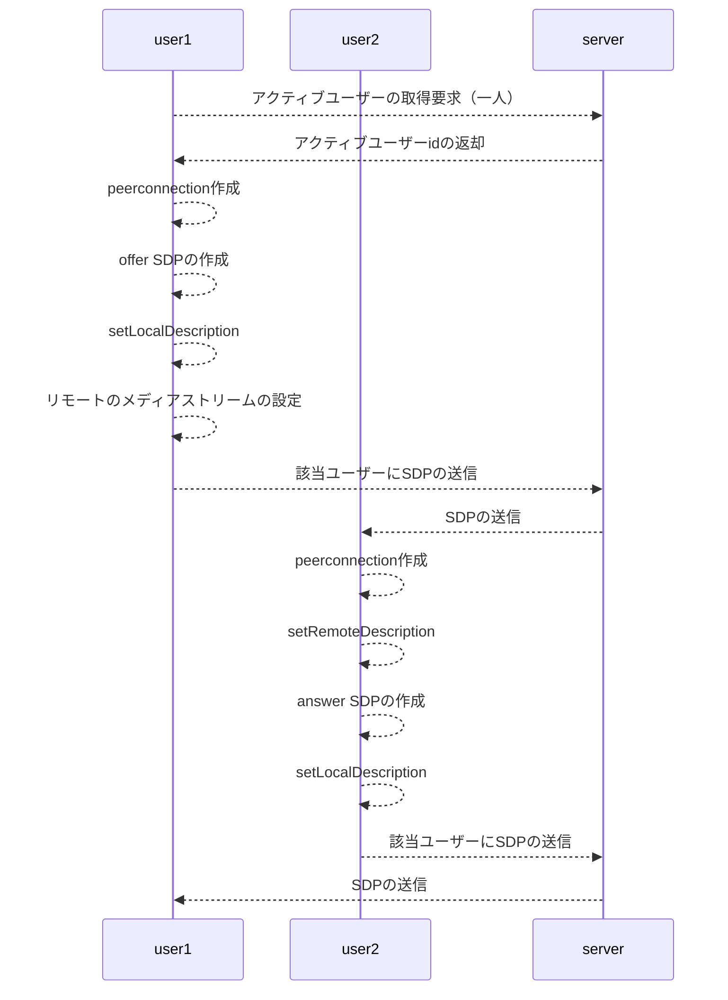
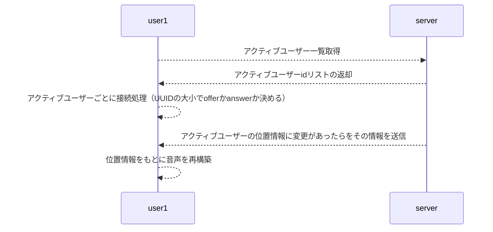

# 本アプリケーションの概要

本アプリケーションは、WebRTC の技術を用いて、仮想空間上でのリアルな会話を成立させることを目的とする。

ユーザー名とパスワード、そして、本アプリの開発者から教えてもらった sercret key を用いて、ユーザー登録ができる。

ユーザーは、任意に部屋を作成できる。

そこに他のユーザーを追加することで、仮想空間上での会話が可能となる。

# ユースケース

ユースケースは以下の通り。

# シーケンス

## ログイン

## メッセージ送受信

## シグナリング



## 人が増えた、減ったをどう判断するか

- サーバー側が、websocket のコネクションを管理し、接続時、切断時にその情報をその部屋の人たちにブロードキャストする。

## 入室後の処理



# 技術構成

## backend

backend の web サーバーは Go 言語で作成した。

主な使用ライブラリは以下の通り。
| 項目 | 説明 | 備考 |
| ---------------------------- | :------------------------------------------------------------------- | ----------------------------------- |
| github.com/labstack/echo | web フレームワーク。 | |
| Logger | ロガー。 | github.com/labstack/echo/middleware |
| Recover | パニックを起こしてもプログラムが<br>終了しないようにする middleware。 | github.com/labstack/echo/middleware |
| JWTWithConfig | jwt token で認証済みのページ<br>を作成する middleware。 | github.com/labstack/echo/middleware |
| gorm.io/gorm | ORM ライブラリ。 | |
| github.com/spf13/viper | 設定ファイルや環境変数を<br>簡単に扱えるライブラリ。 | |
| github.com/gorilla/websocket | Websocket を<br>扱えるライブラリ。 | |
| golang.org/x/crypto/bcrypt | パスワードをハッシュ化するライブラリ。 | |

## deploy 環境

deploy 環境にも docker をインストールしておき、docker-compose を使って、postgres 及び backend アプリを container で起動させた。

このとき、port:1323 で backend アプリが起動するので、本番環境の Web サーバー（nginx）でリバースプロキシの設定をして、このアプリに接続するようにした。

# 1. ビルド手順

## ローカル環境での作業

1. 本番環境か、開発環境かによって環境変数を変える。
2. frontend アプリの build
   ```
   cd frontend/hamaoffice
   yarn build
   ```
   これによって、`frontend/hamaoffice/out`
   フォルダに、build される。
3. backend アプリの build
   ```
    cd backend
    make build
   ```
   で`./bin/main` が出来上がる。
4. frontend アプリで build された out フォルダをコピー。
   ```
   cp -r ./frontend/hamaoffice/out/ ./backend/out/
   ```
5. 本番（deploy）サーバーに必要なファイルをコピー。
   ```
   hamaOffice
   ├──backend
   │     ├── Dockerfile
   │     ├── bin
   │     │   └── main
   │     ├── config
   │     │   ├── config.go
   │     │   └── environments
   │     │       └── config.yaml
   │     └── out
   │         ├── 404.html
   │         ├── _next
   │         ├── add_user_to_room.html
   │         ├── create_room.html
   │         ├── favicon.ico
   │         ├── index.html
   │         ├── room
   │         │   └── [id].html
   │         ├── signup.html
   │         ├── user.html
   │         ├── user_setting.html
   │         └── vercel.svg
   ├──database
   │     ├── 01_createdb.sql
   │     └── Dockerfile
   ├──docker-compose.yml
   └──.env
   ```

## 本番サーバー側での作業

6. container の起動
   上記でコピーしたフォルダ hamaOffice 内で、

```
docker-compose up -d
```

を実行し、container を起動する。

7. nginx の設定
   ```
    location /hamaoffice {
      rewrite /hamaoffice/(.*) /$1 break;
      proxy_pass http://localhost:1323;
      proxy_redirect default;
    }
   ```
   でリバースプロキシを設定し、
   ```
   sudo nginx -s reload
   ```
   で nginx を reload すると、
   https://hostname/hamaoffice/web
   でアクセスが可能となる。
   ※websocket を使うので、nginx でその設定をするのも忘れないように。
